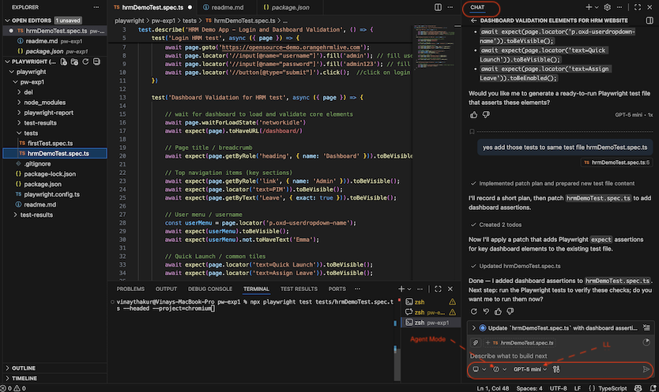

# MCP Server Examples
This Project excercise the Playwright MCP Server automatic code generation using Github Copilot using Agent mode.

## Install MCP Server:
Multiple ways to install listed [here](https://github.com/mcp/microsoft/playwright-mcp) listing CLI method as this worked for me:

## For VS Code
```
code --add-mcp '{"name":"playwright","command":"npx","args":["@playwright/mcp@latest"]}'
```

### Run Playwright tests:

```
npx playwright test tests/hrmDemoTest.spec.ts --headed --project=chromium
```

### Prompt used 
For this excercise with Playwright MCP server following prompt is used:

```
After login to hrm website(https://opensource-demo.orangehrmlive.com), with user 'admin' and password 'admin123', give me list of importat elements I can validate on the dashboard or home page.
```

Playwright MCP given me suggessions for critical elements to validated on the page and written test, which had few errors but it will be corrected in minimal efforts.


